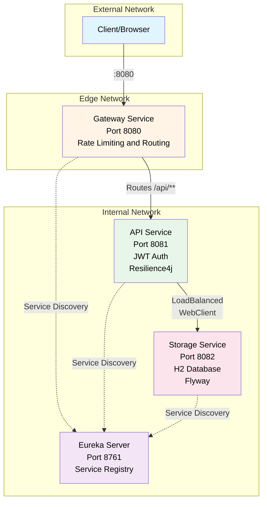

# Overview
This is the main repository for an example Spring Boot/Spring Cloud project.
It consists of four microservices described in detail below.
It is designed to be run either from prebuilt container images (docker-compose.yml) or built locally for development (docker-compose.dev.yml).

### Services in this repo 
1. [eureka-server](https://github.com/Milozap/tec-eureka-server) — service registry: Spring Cloud Netflix Eureka
2. [storage-service](https://github.com/Milozap/tec-storage-service) — persistence: H2 + Flyway
3. [api-service](https://github.com/Milozap/tec-api-service) — REST API aggregating and calling storage-service, JWT protected
4. [gateway-service](https://github.com/Milozap/tec-gateway-service) — service routing to api-service with simple rate limiting

### Networks
- edge – only the Gateway is attached and exposes port 8080 to the host
- internal – all services communicate here (Gateway, API, Storage, Eureka)




### Tech stack
- Language: Java Java 25 
- Framework: Spring Boot 3.5.x, Spring Cloud 2025.0.0
- Build: Gradle
- Datastore: H2 for storage-service
- Packaging/Runtime: Docker and Docker Compose

### Used ports
- gateway-service: 8080
- storage-service: 8081
- api-service: 8082
- eureka-server: 8761

# Requirements
- Docker and Docker Compose 
- Git
- For Development:
  - [JDK 25](https://www.oracle.com/java/technologies/downloads/#jdk25-linux)
  - Gradle
- JWT Token for testing: instructions below

### Files
- .env.example — sample environment; copy to .env and adjust
- docker-compose.yml — uses prebuilt images from a registry. Each repo creates a new image on push to the main branch.
- docker-compose.dev.yml — builds images from local sources for development

# Getting started
1) Clone the repository
   ```shell
   git clone https://github.com/Milozap/tec-architecture
   cd tec-architecture
   ```

2) Prepare environment
   Copy .env.example to .env and update values as needed (make sure to change JWT_SECRET to non-default):
   ```shell
   cp .env.example .env
   ```
## JWT Token generation
To use the api and `/movies` endpoints JWT token is required. To generate the token, websites like https://www.jwt.io/ can be used.
Leave the headers as:
```json
{
  "alg": "HS256",
  "typ": "JWT"
}
```
Set the payload as, for example: 
```json
{
  "sub": "test-user",
  "scope": "movies.read movies.write",
  "iat": 1731950000,
  "exp": 4731953600
}
```
And set the JWT Secret as secret from .env ("dev-jwt-secret-dev-jwt-secret-dev-jwt-secret-dev-jwt-secret" by default)
```text
dev-jwt-secret-dev-jwt-secret-dev-jwt-secret-dev-jwt-secret
```

Click generate example and copy the jwt token. Then use it with `Authorization: Bearer <token>` header to access api routes.

## Dev helper script (multi-repo note)
To run the local build with `docker-compose.dev.yml` all the repos are required. To easily get them run:
```shell
echo "Cloning Eureka server repository"
git clone https://github.com/Milozap/tec-eureka-server.git

echo "Cloning Storage Service repository"
git clone https://github.com/Milozap/tec-storage-service.git

echo "Cloning Api Service repository"
git clone https://github.com/Milozap/tec-api-service.git

echo "Cloning Gateway Service repository"
git clone https://github.com/Milozap/tec-gateway-service.git
```

## Run with prebuilt images
```shell
docker compose --env-file .env -f docker-compose.yml up -d
```

## Update prebuilt images
```shell
docker compose pull
```

## Run with local build - for development
Make sure to get other repos before running this command. Otherwise it will fail.
```shell
docker compose --env-file .env -f docker-compose.dev.yml up -d --build
```

### Local development without Docker (per service)
Each service is a standalone Spring Boot app. From the service directory you can run:
```shell
./gradlew bootRun
```

### Swagger
Swagger docs available at URL: http://localhost:8080/swagger-ui/index.html
Note: requests will not work properly on this repo. Swagger on gateway service is purely informative.
To test swagger requests, please launch api service and use it instead of the gateway service.

### Configuration notes
- Services read EUREKA_URL from the environment (defaults to http://localhost:8761/eureka when running without Docker).
- api-service reads JWT_SECRET from the environment; a default is provided only for development purposes. **Do not** use defaults in production.

### Health and management endpoints
- Actuator endpoints are enabled (health, info; additional endpoints in api-service). Access may be limited depending on the environment and security configuration.
- Docker Compose healthchecks are configured for all services and probe `GET /actuator/health` on the internal container ports:
  - eureka-server: http://localhost:8761/actuator/health
  - storage-service: http://localhost:8081/actuator/health
  - api-service: http://localhost:8082/actuator/health
  - gateway-service: http://localhost:8080/actuator/health
  The checks run every 10s with a 3s timeout, 3 retries and a 30s start period to allow JVM warm‑up.

To inspect the status:
```shell
docker compose ps
docker inspect --format='{{json .State.Health}}' <container_name> | jq
```

# Testing Scenarios
```shell
curl -v "http://localhost:8080/api/movies?page=0&size=5"
```
Should return `401 Unauthorized`.

```shell
curl -v "http://localhost:8080/api/movies?page=0&size=5" -H "Authorization: Bearer <JWT_TOKEN>"
```
Should return `200 OK` and a paged list of movies.

```shell
curl -v "http://localhost:8080/api/movies/1" -H "Authorization: Bearer <JWT_TOKEN>"

```
Should return `200 OK` and the movie, or `Not Found`.

```shell
curl -v -X POST "http://localhost:8080/api/movies" \
  -H "Authorization: Bearer <JWT_TOKEN>" \
  -H "Content-Type: application/json" \
  -d '{
    "title": "New Movie",
    "genre": "New Genre",
    "releaseYear": 2026
  }'
```
Should return `201 Created` and newly added movie.

```shell
curl -v -X PUT "http://localhost:8080/api/movies/1" \
  -H "Authorization: Bearer <JWT_TOKEN>" \
  -H "Content-Type: application/json" \
  -d '{
    "title": "Updated Movie",
    "genre": "Updated Genre",
    "releaseYear": 2019
  }'
```
Should return `200 OK` and updated movie, od `Not Found`.

```shell
curl -v -X DELETE "http://localhost:8080/api/movies/1" -H "Authorization: Bearer <JWT_TOKEN>"
```
Should return `204 No Content` and delete the movie.

### Resilience and chaos testing
Both storage-service and api-service have `/movies/dev/chaos` urls that can be tested.
To test it through the gateway:
```shell
curl -v "http://localhost:8080/api/movies/dev/chaos?delay=5000&errorRate=0" -H "Authorization: Bearer <JWT_TOKEN>"
```

### Correlation ID
```shell
curl -v "http://localhost:8080/api/movies?page=0&size=5" \
  -H "Authorization: Bearer <JWT_TOKEN>" \
  -H "X-Correlation-ID: test-123"
```
Logs for both API and storage will have same `X-Correlation-ID`. 
If we don't provide `X-Correlation-ID` it will be generated as UUID.

### Rate Limiting
Example script:
```shell
for i in {1..30}; do
  curl -s -o /dev/null -w "%{http_code}\n" \
    "http://localhost:8080/api/movies?page=0&size=1" \
    -H "Authorization: Bearer <JWT_TOKEN>"
done
```
The first few responses will have status code `200` and then, after we hit the limit we'll see `429 Too Many Requests`